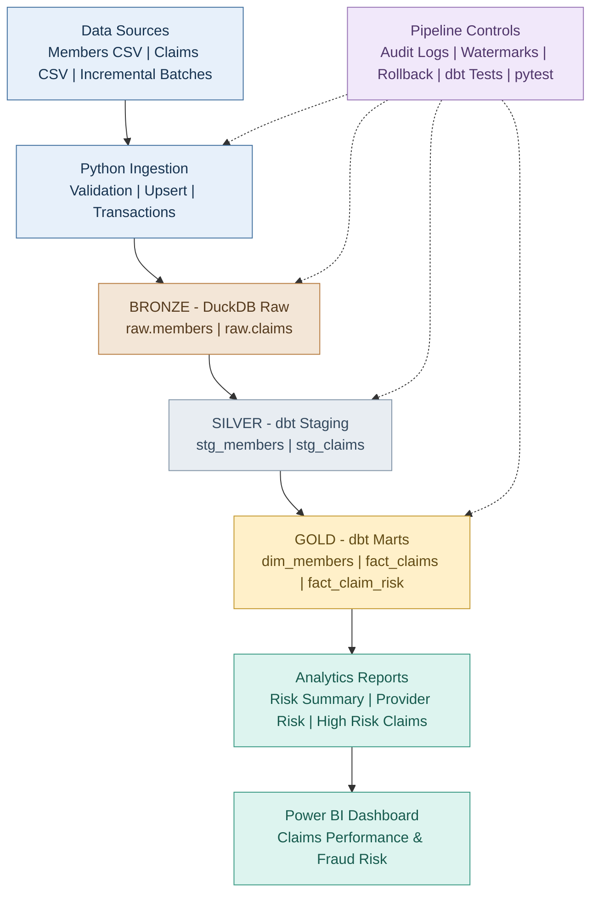

# Healthcare Claims Data Engineering Architecture

```mermaid
flowchart TD
    A["Data Sources<br/>Members CSV | Claims CSV | Incremental Batches"]
    B["Python Ingestion<br/>Validation | Upsert | Transactions"]
    C["BRONZE - DuckDB Raw<br/>raw.members | raw.claims"]
    D["SILVER - dbt Staging<br/>stg_members | stg_claims"]
    E["GOLD - dbt Marts<br/>dim_members | fact_claims | fact_claim_risk"]
    F["Analytics Reports<br/>Risk Summary | Provider Risk | High Risk Claims"]
    G["Power BI Dashboard<br/>Claims Performance & Fraud Risk"]
    H["Pipeline Controls<br/>Audit Logs | Watermarks | Rollback | dbt Tests | pytest"]

    A --> B --> C --> D --> E --> F --> G
    H -.-> B
    H -.-> C
    H -.-> D
    H -.-> E

    classDef source fill:#e7f0fa,stroke:#4472a0,color:#183451
    classDef bronze fill:#f3e6d7,stroke:#b67c42,color:#563b1e
    classDef silver fill:#e8edf2,stroke:#8396a8,color:#34495e
    classDef gold fill:#fff0c9,stroke:#c49a32,color:#634c15
    classDef report fill:#ddf4ef,stroke:#3d9b86,color:#175b4e
    classDef control fill:#f1e8fa,stroke:#9874b5,color:#50366b

    class A,B source
    class C bronze
    class D silver
    class E gold
    class F,G report
    class H control
```
